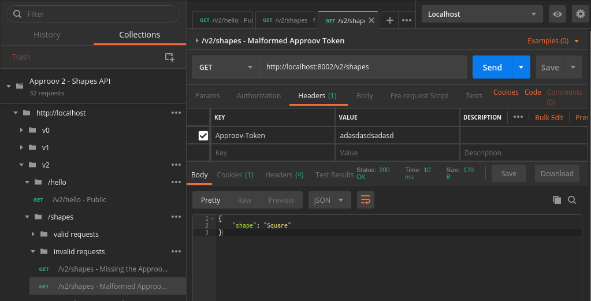
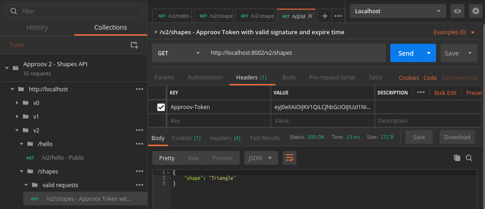
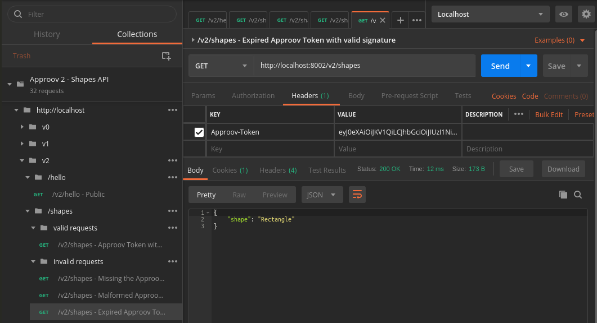
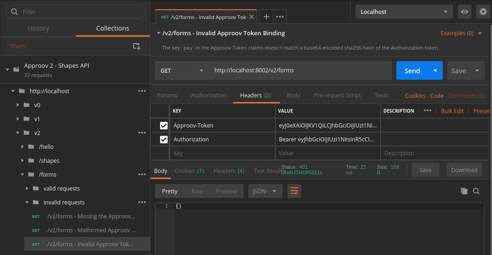

# APPROOV SHAPES API SERVER

The Approov Shapes API Server contains endpoints with and without the Approov
protection. The protected endpoints differ in the sense that they can use or not
the optional token binding feature for the Approov token.

We will demonstrate how to call each API endpoint with screen-shots from Postman
and from the shell terminal. Postman is used here as an easy way to demonstrate
how you can play with the Approov integration in the API server, but to see a
real demo of how Approov would work in production you need to request a demo
[here](https://info.approov.io/demo).

When presenting the screen-shots we will present them as 2 distinct views. The
Postman view will tell how we performed the request and what response we got
back and the shell view show us the log entries that lets us see the result of
checking the Approov token and how the requested was handled.


## REQUIREMENTS

The same as we defined [here](README.md#requirements) when explain how to
integrate Approov.


## INSTALL

### Approov Shapes Api Server

Let's start by cloning the demo:

```bash
git clone https://github.com/approov/quickstart-java-spring_shapes-api.git
cd quickstart-java-spring_shapes-api
```

### Development Environment

In order to have an agnostic development environment through this tutorial we
recommend the use of Docker, that can be installed by following [the official
instructions](https://docs.docker.com/install/) for your platform.

A bash script `./stack` is provided in the root of the demo to make easy to use
the docker stack to run this demo.

Show the usage help with:

```bash
./stack --help
```

The output:

```bash
DOCKER STACK CLI WRAPPER

This bash script is a wrapper around docker for easier use of the docker stack
in this project.

Signature:
  ./stack [options] <command> <args>


Usage:
  ./stack
  ./stack [-d, --detach] [-h, --help] [--http] [--https] [-u, --user] <command> <args>


Options:
  -d, --detach    Runs the docker container detached from the terminal.
                    $ ./stack --detach up

  -h, --help      Shows this help.
                    $ ./stack --help

  --http          The HTTP port map host:container.
                  Defaults to use port map 5000:5000.
                    $ ./stack --http 8000:5000 up

  --https         The HTTPS port map host:container.
                  Defaults to use port map 5443:5443.
                    $ ./stack --https 8443:5443 up

  -u, --user      Run the docker container under the given user name or uid.
                    $ ./stack --user root shell

Commands/Args:
  build           Builds the docker image for this stack.
                    $ ./stack build

  down            Stops and removes the docker container.
                    $ ./stack down

  up              Starts the docker container with the Java server running.
                    $ ./stack up
                    $ ./stack --detach up
                    $ ./stack --detach --https 8443:5443 up
                    $ ./stack --http 8000:5000 --https 8443:5443 up

  shell <name>    Starts a shell in the docker container:
                    $ ./stack shell
                    $ ./stack shell bash
                    $ ./stack --http 4000:5000 shell
                    $ ./stack --user root shell
```

#### Building the docker image:

```bash
./stack build
```
> The resulting docker image will contain the Approov Shapes Demo Server in Java.


## SETUP

### Environment File

Lets' copy the `.env.example` to `.env` with the command:

```bash
cp .env.example .env
```

No modifications are necessary to the newly created `.env` in order to run the
demo with the provided Postman collection.

### Getting a shell terminal inside the docker container:

```bash
./stack shell
```
> All subsequent shell commands must be executed from this shell terminal.

### Building the Project

Lets' try to build the project:

```bash
./gradlew build
```

The output:

```
# omitted output ...

BUILD SUCCESSFUL in 33s
5 actionable tasks: 3 executed, 2 up-to-date
```

The build went successful, thus we are ready to start playing around with the
server.

## RUNNING THE APPROOV SHAPES DEMO SERVER

We will run this demo first with Approov enabled and a second time with Approov
disabled. When Approov is enabled any API endpoint protected by an Approov token
will have the request denied with a `400` or `401` response. When Approov is
disabled the check still takes place but no requests are denied, only the reason
for the failure is logged.

### The logs

When a request is issued from Postman you can see the logs being printed to your
shell terminal where you can see all log entries about requests protected by
Approov, and compare the logged messages with the results returned to Postman
for failures or success in the validation of the Approov token.

An example for an accepted request:

```bash
2019-04-26 11:42:30.503  INFO 17062 --- [nio-5000-exec-2] c.c.a.j.a.ApproovAuthentication          : Request approved with a valid Approov token.
2019-04-26 11:42:30.503  INFO 17062 --- [nio-5000-exec-2] c.c.a.j.a.ApproovAuthentication          : Request approved with a valid token binding in the Approov token.
2019-04-26 11:42:30.524  INFO 17062 --- [nio-5000-exec-2] c.c.a.j.a.ApproovAuthentication          : Serving request for endpoint '/v2/forms', that is protect by an Approov Token.
```

Example for a rejected request:

```bash
2019-04-26 11:43:43.083 ERROR 17062 --- [nio-5000-exec-5] c.c.a.j.a.ApproovAuthenticationException : JWT expired at 2019-04-12T15:35:49Z. Current time: 2019-04-26T10:43:43Z, a difference of 1192074083 milliseconds.  Allowed clock skew: 0 milliseconds. -> See: com.criticalblue.approov.jwt.authentication.ApproovAuthentication.checkWith(ApproovAuthentication.java:98)

```

### Starting Postman

Open Postman and import [this collection](https://raw.githubusercontent.com/approov/postman-collections/master/quickstarts/shapes-api/shapes-api.postman_collection.json)
that contains all the API endpoints prepared with all scenarios we want to
demonstrate.

### Starting the Java Server

We do not use HTTPS and certificate pinning in this demo, because we are running in localhost, that would require us to provide self-signed certificates to start the Java server with HTTPS enabled, that is doable, but we also use Postman to show how the API works, and Postman does not support self-signed certificates.

This server has `HTTPS` enabled with a self-signed certificate at
`src/main/java/resources/keystore/ApproovTLS.p12`, thus feel free to use it in
another tool that supports self-signed certicates, and then just hit the same
API endpoints hover `HTTPS`, or change the setting `HTTP_REDIRECT` to `true` in
the `.env` file.

To start the server we want to issue the command:

```bash
source .env && ./gradlew bootRun
```

> **NOTE**:
>
> If you decide to run the Java server from your IDE, then you need to set all
> the environments variables in the `.env` file in your IDE.

After the Java server is up and running it will be available at http://localhost:8002.

### Endpoint Not Protected by Approov

This endpoint does not benefit from Approov protection and the goal here is to
show that both Approov protected and unprotected endpoints can coexist in the
same API server.

#### /v2/hello

**Postman View:**


> As we can see we have not set any headers.

**Shell view:**


> As expected the logs don't have entries with Approov errors.


**Request Overview:**

Looking into the Postman view, we can see that the request was sent without the
`Approov-Token` header and we got a `200` response, and looking to the shell
view we can see a log entry telling that this is a endpoint not protected by an
Approov token.

### Endpoints Protected by an Approov Token

This endpoint requires a `Approov-Token` header and depending on the boolean
value for the environment variable `APPROOV_ABORT_REQUEST_ON_INVALID_TOKEN` we will
have 2 distinct behaviours. When being set to `true` we refuse to fulfill the
request and when set to `false` we will let the request pass through. For both
behaviours we log the result of checking the Approov token.

The default behaviour is to have `APPROOV_ABORT_REQUEST_ON_INVALID_TOKEN` set to
`true`, but you may feel more comfortable to have it setted to `false` during
the initial deployment, until you are confident that you are only refusing bad
requests to your API server.

#### /v2/shapes - missing the Approov token header

Make sure that the `.env` file contains `APPROOV_ABORT_REQUEST_ON_INVALID_TOKEN` set to `true`.

Cancel current server session with `ctrl+c` and start it again with:

```bash
source .env && ./gradlew bootRun
```

**Postman view:**


> As we can see we have not set any headers.

**Shell view:**


> No log entries for Approov exceptions in this request?

**Request Overview:**

Looking to the Postman view we can see that we forgot to add the `Approov-Token`
header, thus a `400` response is returned.

In the shell view we can also see that we have a `400` response, and that the associated exception doesn't belong to the
Approov implementation, instead its from the Java Spring framework security authentication.

**Let's see the same request with Approov disabled**

Make sure that the `.env` file contains `APPROOV_ABORT_REQUEST_ON_INVALID_TOKEN` set to `false`.

Cancel current server session with `ctrl+c` and start it again with:

```bash
source .env && ./gradlew bootRun
```

**Postman view:**


> Did you notice that now we have a response with a shape?

**Shell view:**


> Now we have some logs entries from the Approov authentication.

**Request Overview:**

We continue to not provide the `Approov-Token` header but this time we have a
`200` response with the value for the shape, because once Approov is disabled the
request is not denied.

Looking into the shell view we can see a log entry informing that the Approov token is missing in the request, but now
we can see another log entry for the `/v2/shapes` endpoint, that says the request was fulfilled.


#### /v2/shapes - Malformed Approov token header

Make sure that the `.env` file contains `APPROOV_ABORT_REQUEST_ON_INVALID_TOKEN` set to `true`.

Cancel current server session with `ctrl+c` and start it again with:

```bash
source .env && ./gradlew bootRun
```

**Postman view:**


> Did you notice the `Approov-Token` with an invalid JWT token?

**Shell view:**


> Can you spot what is the reason for the `401` response?

**Request Overview:**

In Postman we issue the request with a malformed `Approov-Token` header, that is
a normal string, not a JWT token, thus we get back a `401` response.

Looking to shell view we can see that the logs is also telling us that the
request was denied with a `401` and that the reason is an invalid JWT token,
that doesn't contain exactly 2 periods `.` characters.


**Let's see the same request with Approov disabled**

Make sure that the `.env` file contains `APPROOV_ABORT_REQUEST_ON_INVALID_TOKEN` set to `false`.

Cancel current server session with `ctrl+c` and start it again with:

```bash
source .env && ./gradlew bootRun
```

**Postman view:**




**Shell view:**


**Request Overview:**

In Postman, instead of sending a valid JWT token, we continue to send the
`Approov-Token` header as a normal string, but this time we got a `200` response
back because Approov is disabled, thus not blocking the request.

In the shell view we continue to see the same reason for the Approov token
validation failure.


#### /v2/shapes - Valid Approov token header

Make sure that the `.env` file contains `APPROOV_ABORT_REQUEST_ON_INVALID_TOKEN` set to `true`.

Cancel current server session with `ctrl+c` and start it again with:

```bash
source .env && ./gradlew bootRun
```

> **NOTE**:
>
> For your convenience the Postman collection includes a token that only expires
> in a very distant future for this call "Approov Token with valid signature and
> expire time". For the call "Expired Approov Token with valid signature" an
> expired token is also included.


**Postman view with token correctly signed and not expired token:**



**Postman view with token correctly signed but this time is expired:**


**Shell view:**


**Request Overview:**

In Postman we performed 2 requests with correctly signed Approov tokens, where the first one was successful while the second request failed with a `401` response. This was because the token in the second request as already expired as we can see by the log messages in the shell view. A token expires when the timestamp contained in the payload claim `exp` is in the past.


**Let's see the same request with Approov disabled**

Make sure that the `.env` file contains `APPROOV_ABORT_REQUEST_ON_INVALID_TOKEN` set to `false`.

Cancel current server session with `ctrl+c` and start it again with:

```bash
source .env && ./gradlew bootRun
```
**Postman view with token valid for 1 minute:**


**Postman view with same token but this time is expired:**



**Shell view:**


> Can you spot where is the difference between this shell view and the previous one?

**Request Overview:**

We repeated the same two requests, but this time we got both of them with `200` responses.

If we look into the shell view we can see that the first request have
a valid token and in the second request the token is not valid because is
expired, but once Approov is disabled the request is accepted.

### Endpoints Protected with the Approov Token Binding

The token binding is optional in any Approov token and you can read more about them [here](./../README.md#approov-validation-process).

The requests where the Approov token binding is checked will be rejected on failure, but
only if the environment variable `APPROOV_ABORT_REQUEST_ON_INVALID_TOKEN_BINDING`
is set to `true`. To bear in mind that before this check is done the request
have already been through the same flow we have described for the `/v2/shapes` endpoint.


#### /v2/forms - Invalid Approov Token Binding

Make sure that the `.env` file contains `APPROOV_ABORT_REQUEST_ON_INVALID_TOKEN_BINDING` set to `true`.

Cancel current server session with `ctrl+c` and start it again with:

```bash
source .env && ./gradlew bootRun
```

**Postman view:**



**Shell view:**


**Request Overview:**

In Postman we added an Approov token with a token binding not matching the
`Authorization` token, thus the API server rejects the request with a `401` response.

While we can see in the shell view that the request is accepted for the Approov
token itself, afterwards we see the request being rejected, and this is due to
an invalid token binding in the Approov token, thus returning a `401` response.

> **IMPORTANT**:
>
> When decoding the Approov token we only check if the signature and expiration
> time are valid, nothing else within the token is checked.
>
> The token binding check works on the decoded Approov token to validate if the
> value from the key `pay` matches the one for the token binding header, that in
> our case is the `Authorization` header.


**Let's see the same request with Approov disabled**

Make sure that the `.env` file contains `APPROOV_ABORT_REQUEST_ON_INVALID_TOKEN_BINDING` set to `false`.

Cancel current server session with `ctrl+c` and start it again with:

```bash
source .env && ./gradlew bootRun
```

**Postman view:**


**Shell view:**


**Request Overview:**

We still have the invalid token binding in the Approov token, but once we have
disabled Approov we now have a `200` response.

In the shell view we can confirm that the log entry still reflects that the
token binding is invalid, but this time a `401` response is not logged, and
this is because Approov is now disabled.


#### /v2/forms - Valid Approov Token Binding

Make sure that the `.env` file contains `APPROOV_ABORT_REQUEST_ON_INVALID_TOKEN_BINDING` set to `true`.

Cancel current server session with `ctrl+c` and start it again with:

```bash
source .env && ./gradlew bootRun
```

**Postman view:**


**Shell view:**


**Request Overview:**

In the Postman view the `Approov-Token` contains a valid token binding, the
`Authorization` token value, thus when we perform the request, the API server
doesn't reject it, and a `200` response is sent back.

The shell view confirms us that the token binding is valid and we can also see
the log entry confirming the `200` response.
